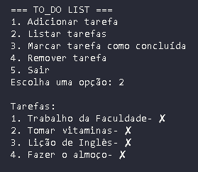

# TO_DO LIST Terminal

Uma To_Do List simples feita em python que roda no terminal, permitindo adicionar, listar, concluir e remover tarefas.
Com salvamento automático em arquivo JSON

## Funcionalidades

- ✔ Adicionar tarefas
- ✔ Listar tarefas
- ✔ Marcar tarefas como concluídas
- ✔ Remover tarefas
- 💾Salvar tarefas em arquivo JSON

## Como rodar

1. Clone o repositório:
   ```bash
   git clone https://github.com/raquelpwn/to_do_list-terminal.git
   ```
2. Entre na pasta:

   ```bash
   cd to_do_list-terminal

   ```

3. Rode o programa:
   ```bash
   python to_do.py
   ```
## <p align= "center">**Exemplo da To_Do List**</p>

<p align="center">
 
</p> 

